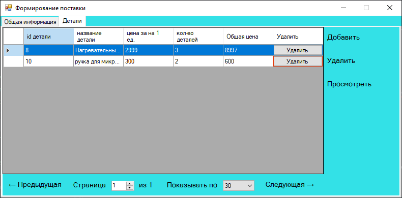
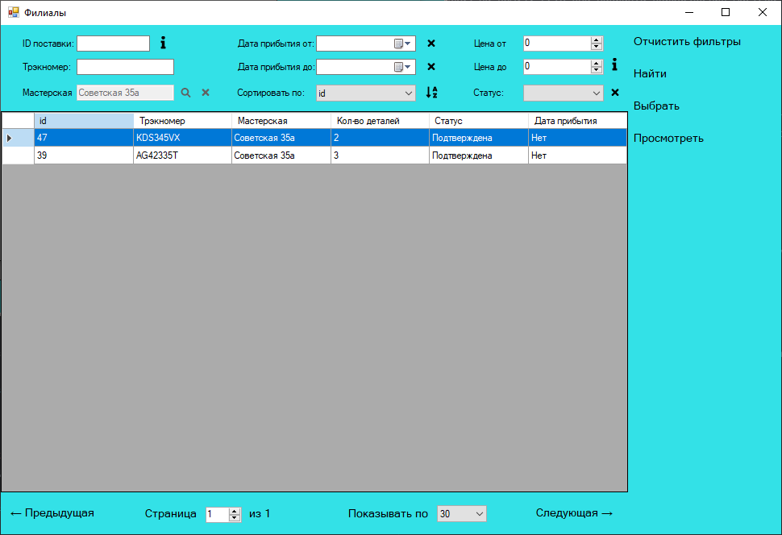

# Навигация
- [авторизация](Авторизация)
- [главное меню](Главное-меню)
- [поиск](Поиск-и-сортировка)
- [клиенты](Клиенты)
- [сотрудники](Сотрудники)
- [услуги](Услуги)
- [категории](Категории)
- [мастерские](Мастерские-(филиалы))
- [запчасти](Запчасти)
- [поставки](Поставки-(детали))
- [заказы](Заказы)
- [выезды](Выезды)
- [статистика](Статистика)

## Авторизация
При запуске программы необходимо авторизоваться. Для удобства текстбокс с номером телефона имеет настроенную маску, чтоб избежать ошибок ввода, а текстбокс с паролем скрывает вводимые символы. 

## Главное меню
После входа пользователя встречает главное меню и необходимо выбрать одну из вкладок, которые находятся справа. 

 

Некоторые вкладки включают себе сразу несколько элементов, в этом случае при их выборе сайдбар раздивается, как показано на скриншоте ниже. 

## Клиенты
Действия, связанные с управлением клиентами находятся на вкладке "КЛИЕНТЫ", там доступно управление как базов клиентов, так и техникой клиентов. 

### Управление клиентом
При добавление нового клиента, сначала запрашивается общая информация, затем предлагается сразу же добавить технику. 

Если был выбрал вариант "Да", то форма открывается с доступной вкладкой "Техника", на которой можно добавлять/удалять/просматривать технику выбранного клиента. 

### Управление техникой клиентов
В случае, если мы добавляем технику из формы управления клиентом, то необходимо ввести наименование техники, клиента и категорию, к которой относится данная техника. Если же добавление происходит из форма клиента, то поле "Клиент" будет заполнено автоматически. 

При просмотре технике доступна вкладка "История ремонта", которая отображает все заявки на ремонт выбранной технике. Также подобная вкладка доступна при просмотре клиента. 

При удаление техники из клиента, техника удалиться окончательно, также при удалении клиента вся его техника автоматически удаляется

## Сотрудники
Во вкладке "СОТРУДНИКИ" доступны четыре окна: все сотрудники (менеджеры + мастера), мастера, менеджеры, должности (роли) 

Вкладки "мастера" и "менеджеры" отличаются тем, что во вкладке мастера появляется дополнительное поле сортировки "Категория", а во вкладке менеджеры "Работает удаленно"

### Управление сотрудниками
При добавление мастера сначала требуется ввести общую информацию, затем предлагается сразу же добавить категории и расписание 

 

Управление менеджерами аналогично управлению мастерами, за тем исключением, что у менеджеров нету категорию, но есть флаг "Работает удалено"

### Расписание сотрудников
Расписание можно добавить сразу же на несколько недель вперед, при этом при возникновении конфликтов (у сотрудника уже есть раписание на выбранный период/филиал, в котором работает сотрудник не работает в выбранное время) появляется сообщение об ошибке. 

### Должности
Должность сотрудника определяет то, какие действия ему доступны в системе 

Должность может относится либо к мастерам, либо к менеджерам, либо ко всем. Если должность относится только к мастерам, то менеджеру ее присвоиться нельзя. 

После сохранения общей информации нужно добавить права для выбранной должности 

## Услуги
Все услуги разделены на категории и имею ориентировочное время оказания 

## Категории
Категории нужны для разделения техники и услуг, а также список категорий хранится у мастеров, чтоб определить, какие виды техники он умеет чинить. 

Категорию имеет иерархичную структуру поэтому у каждой услуги может быть родительская категория и при просмотре конкретной услуги показываются ее связи 

## Мастерские (филиалы)
Каждый сотрудник относится к конкретному филиалу, также каждый заказ и поставка имеют привязку к нему 

У каждого филиала есть свое расписание, с которым согласуется расписание всех сотридников этого филиала 

## Запчасти (детали)
Для проведения ремонта могут требовать различные детали, поэтому в программе контролируется список запчастей и из наличие 

При просмотре конкретной детали можно увидеть ее наличие в различных мастерских 

## Поставки
Для заказа запчастей и учета их пополнения предусмотрена работа с поставками 

При добавлении новой поставки сначала указывается общая информация, затем нужно добавить запчасти, которые будут в поставки, их количество и цену 

Также все поставки имеют три статуса: создана, подтверждена (в пути), прибыла. Когда у поставки появляется статус подтверждена или прибыла, то ее содержание изменить уже будет невозможно

## Заказы
В системе есть два вида заказов: в мастерской и на дому. Вкладка просмотре всех заказов на дому отличается от первой тем, что там появляется дополнительное поле сортировки "Адрес". 

При добавление нового заказа сначала заполняется общая информация (включая адрес, если заказ на дому). Есть два варианта прикрепления мастера к заказу: автоматически и вручную. Если выбран вариант "автоматически", то мастер добавиться автоматически, исходя из того, какая выбрана мастерская и категория у техники. 

Затем открывается окно с большим количеством функций: добавление услуг к заказу, деталей для ремонта, выезды (если заказ на дому), а также есть вкладка "История", в которой фиксируются все изменения в заказе (например, добавление новой услуги к заказу, смена статуса заказа и т.д.). Также на главной странице заказа появляется настройка статуса заказа и внесения предоплаты. 

### Услуги в заказе
При добавление услуг к заказу открывается форма с услугами, где отображены все услуги, которые имеют ту же категорию, что и техника, а также услуги родительских категорий выбранной техники 

Также услуги в заказе могут быть отмечены как сделанные и не сделанные. Это сделано для удобства планирования задач мастеров, а также для управления услугами в выездах, если заказ на дому. 

### Детали в заказе
При добавлении деталей к заказу показывается их наличие в мастерской, к которой привязан заказ 

После выбора детали будет предложено два варината добавления: автоматически и вручную. Если выбран вариант автоматически, то поставки с выбранном типом деталей добавятся автоматически, причем приоритет будут иметь те, что имеют статус "Прибыла".

 

При ручном добавлении пользователь должен сам выбрать подходящие ему поставки 

### Выезды
Работа с выездами доступна с заказами на дому. 

При добавлении нового заказа сначала указывается дата, потом нужно добавить услуги, которые планируется оказать во время выполнения выездах. Если услуга в заказе помечена как "Сделана", то добавить ее к выезду нельзя. 

Если мастер не работает в указанную дату или на это время у него назначен другой выезд, то появится сообщение с ошибкой.

### История
Все изменения в заказе автоматически фиксируются во вкладке "История". Там указано, какое изменение произошло и какой пользователь его совершил. 

## Выезды
Работа с выездами доступна как при просмотре их в отдельной вкладке, так и при их просмотре во время работы с заказов на дому 

При добавлении нового заказа сначала указывается заказ, к которому относится выезд, дата, а потом нужно добавить услуги, которые планируется оказать во время выполнения выезда. Если услуга в заказе помечена как "Сделана", то добавить ее к выезду нельзя. 

Если мастер не работает в указанную дату или на это время у него назначен другой выезд, то появится сообщение с ошибкой.

## Статистика
Во вкладке "СТАТИСТИКА" можно посмотреть различную статистику за разные временные периоды 

### Нагрузка
Тут отображается нагрузка на мастерские, которая рассчитыватся как отношение количества заказов на количество мастеров. Чем равнее показатели, тем равномернее нагрузка на мастерские. 

### Выручка
Тут отображается выручка мастерских 

### Услуги
Тут отображается популярность различных услуг 

## Поиск и сортировка
В программе предусмотрен поиск всеразличных сущностей при их просмотре (сотрудников, клиентов, услуг и т.д.) 

На данном примере можно осуществлять поиск категория по их id, названию, категории и цене. Также есть функция "Показывать услуги род. категорий (если ищем по категории)" и сортировка по различным полям.

 

Чтоб найти услуги определенной категории нужно нажать на значок лупы и тогда откроется соответствующая форма с выбором категории 

Также возможно осуществлять сортировку по какому-то полю в порядке возрастания/убывания. По умолчанию идет сортировка по id по убыванию 

Чтоб применить все условия поиска нужно нажать кнопку "Найти", чтоб отчистить поля фильтрации - "Очистить фильтры"
